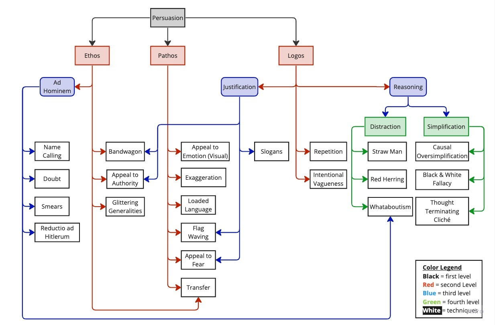
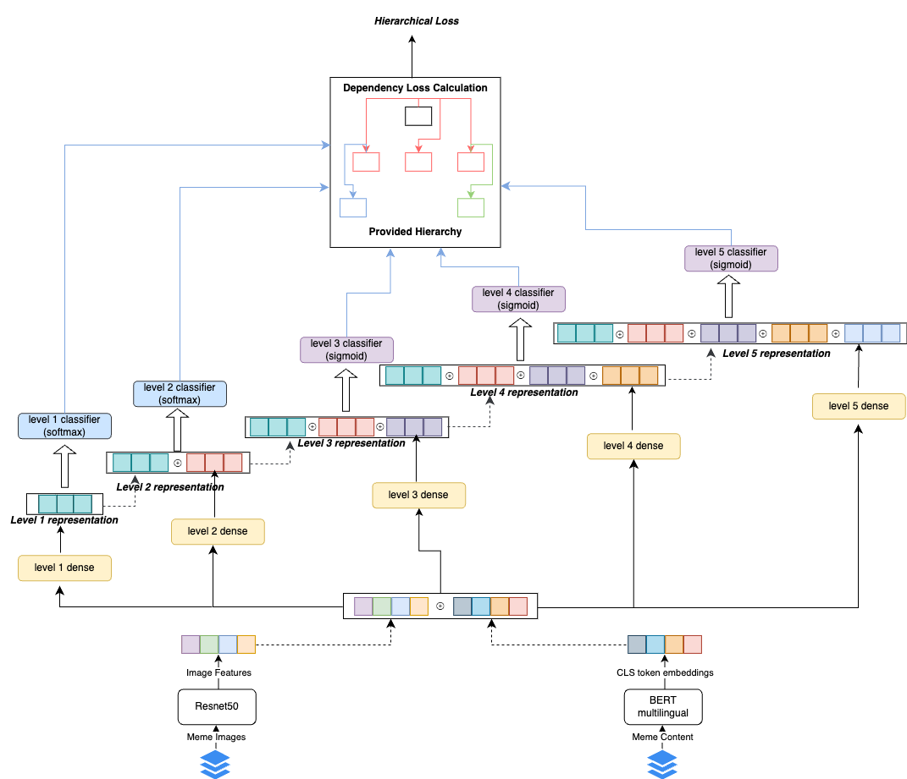
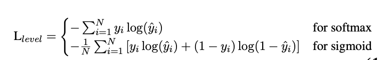

# Hierarchical Detection of Persuasion Techniques in Memes

---

## **Table of Contents**
1. [Project](#project)
2. [Data](#data)
2. [Persuasion Techniques](#techniques)
3. [Related Work](#related-work)
4. [Hierarchical Loss Function](#hierarchical-loss-function)
5. [Results](#results)
6. [Discussion and Error Analysis](#discussion-and-error-analysis)
7. [Conclusion](#conclusion)
8. [Usage](#usage)
8. [References](#references)

---

## **Project**
Memes have evolved from entertainment to powerful instruments for online disinformation campaigns. This project aims to build robust models to detect persuasion techniques embedded within memes, enhancing the ability to mitigate the impact of such content on public opinion.

"Detecting Persuasion Techniques in Memes" is a research project aimed at identifying and analyzing various persuasion techniques used in memes. This project is part of the SemEval2024
shared task on "Multilingual Detection of Persuasion Techniques in Memes." The challenge involves understanding and classifying the persuasive elements in memes, which may include logical 
fallacies and emotional appeals, among others.

Memes are a potent medium in online discourse, often used in disinformation campaigns. By combining text and images, they can effectively influence public opinion. 
This project seeks to detect these techniques through hierarchical multilabel classification tasks, analyzing both the textual and visual components of memes. 

The tasks are divided into:
- **Subtask 1:** Identification of persuasion techniques from the textual content alone.
- **Subtask 2a:** Multimodal analysis, identifying persuasion techniques from both text and image.

This repository contains the code, models developed for the SemEval2024 competition, providing tools to tackle the challenges of detecting persuasion in multimodal content.

## Data

To access the data for this project and submit your predictions, register at the following link:

[SemEval2024 Registration](https://propaganda.math.unipd.it/semeval2024task4/)

After registration, you will be able to download the data and participate in the tasks by submitting your predictions through the provided platform.


---

## **Techniques**
Recent research has identified 22 persuasion techniques applied across textual and visual mediums. This project tackles the challenge of identifying these techniques through a **multi-label hierarchical classification** approach. Given the evolving nature of internet memes and their heavy reliance on current trends and sarcasm, detecting such techniques requires a sophisticated methodology.
<div align="center">

</div>

---

## **Related Work**
- **Propaganda Detection:** Traditional binary classifiers like SVM, Naive Bayes, and Random Forest show limitations in identifying complex hate speech.  
- **Transformer Models:** Advanced methods such as DeBERTa, XLM-RoBERTa, and GPT-3 have demonstrated improved performance in multimodal setups.  
- **Shared Tasks:** Models from competitions like SemEval highlight the importance of transformer-based and multimodal approaches for detecting propaganda.

---

## **Architecture**
<div align="center">

</div>

---

## **Hierarchical Loss Function**
The **hierarchical loss** is designed to maintain consistency across classification levels:  

1. **Layer-Specific Loss:** Layer specific loss is straight forward it is summation of losses at each level for predictions made by considering both current level and previous level (parent level) representations. Formulation of this loss at each level is given as:

<div align="center">

</div>


The sum of all layers is defined as:

$$
L_{\text{layer specific}} = \sum_{l=1}^{5} L_{l}
$$

2. **Dependency Loss:** Penalizes incorrect predictions that deviate from valid parent-child relationships.  
   
$$
D_l = \text{softplus} \left( \sum_{k \in C_{labels}} \delta(k, P_{labels}) \right) 
$$


where $C_{labels}$ is the set of predicted labels at $level_l$ for instance $i$, $ P_{labels}$is the set of predicted labels at $level_{l - 1}$ (parent level), and $\delta(k, P_{labels})$ is an indicator function that returns 1 if label $k$ is not a valid child of any labels in $P_l(i)$, and 0 otherwise.


The total dependency loss is then:

$$
L_{dependency} = \sum_{l=2}^{L} ploss_{l-1}^{D_l + l_{prev}} \cdot ploss_{l}^{D_l + l_{curr}}
$$


where $ploss_{l-1}$ and $ploss_l$ are predefined values that escalate with the hierarchy level to impose heavier penalties for misclassifications at higher levels, and $\beta$ is a scaling factor for the dependency loss’s overall impact. Where $l_{prev}$ and $l_{curr}$ are the number of classes that are correctly classified in previous and current level.

Overall, Hierarchical loss is given by

$$
H_{loss} = \alpha \cdot L_{layer\_specific} + \beta \cdot L_{dependency}
$$

where $\alpha$ and $\beta$ are hyperparameters.

---

## Results

The following table provides the success of Hierarchical loss over conventional BCE loss for multi label classification.

| Feature Extractor | Loss Function | Hierarchical F1 | Hierarchical Precision | Hierarchical Recall |
|------------------|----------------|----------------|-----------|---------|
| mBERT | Traditional BCE | 0.518 | 0.615 | 0.448 |
| mBERT | Hierarchical Loss | 0.573 ⬆️ (10.62%) | 0.586 | 0.560 ⬆️ (25%) |
| OpenAI text-embedding-3-large | Traditional BCE | 0.585 | 0.659 | 0.526 |
| OpenAI text-embedding-3-large | Hierarchical Loss | 0.645 ⬆️ (10.26%) | 0.656 | 0.635 ⬆️ (20.72%) |
| SOTA | - | 0.752 🏆 | 0.684 | 0.836 |

Notes: ⬆️ indicates improvement over baseline | 🏆 indicates best performance | Percentages show relative improvement


Achieved *state-of-the-art results* in Bulgarian and Macedonian languages for SemEval 2024 Task 4 (Subtask 2a).

| Language    | H-F1 (Subtask 1) | H-F1 (Subtask 2a) |
|-------------|------------------|-------------------|
| English     | 0.66391          | 0.69666           |
| Bulgarian   | 0.48411          | 0.65638           |
| Macedonian  | 0.46615          | 0.69844           |
| Arabic      | 0.44478          | 0.53378           |

---

## Discussion and Error Analysis

- **Misclassification Issues:** Instances where the model predicted incorrect techniques (e.g., predicting “Loaded Language” instead of “Doubt”).
- **Multimodal Challenges:** Handling multiple speakers within memes remains a challenge. Further improvements could be made through *data cleaning* and *prompt engineering* with large language models.

---

## Conclusion

This project successfully demonstrates the potential of hierarchical classification for detecting persuasion techniques in memes. With improvements in *loss functions* and *advanced embeddings*, the model achieves state-of-the-art performance. Future work will explore more *robust multimodal integration* and *language expansion* to further enhance meme analysis.

## Usage

To reproduce the results of this project, follow these steps to set up the environment and run the implementation.

1. First, clone the project repository from GitHub:

```bash
git clone https://github.com/iqbal-sk/Detecting-Persuasion-Techniques-in-Memes.git
cd Detecting-Persuasion-Techniques-in-Memes
```
2. It is recommended to use a virtual environment to avoid dependency conflicts. You can create a virtual environment using `venv`:
```bash
python -m venv env
source env/bin/activate
```
3. Once the virtual environment is activated, install the project dependencies listed in the requirements.txt file:
```bash
pip install -r requirements.txt
```
4. Configure the Task and Models

Open the configuration file (`config.j2`) and set the task variable and the corresponding models as follows:

- **task:** Choose either `subtask1` or `subtask2a`.
  - For **subtask1**, configure only the `text_model`:
    - Possible values: `"mBERT"`, `"XLNet"`, `"XLMRoBERTa"`, `"OpenAiSmall"`, `"OpenAiLarge"`
  - For **subtask2a**, configure both `text_model` and `image_model`:
    - `text_model`: `"OpenAiSmall"`, `"OpenAiLarge"`, `"mBERT"`
    - `image_model`: `"ResNet50"`, `"CLIP"`

You can adjust the `hyperparameters` to better suit your experiments. Modify the hyperparameters section in the configuration file (`config.j2`)

## References

1. Gao, Dehong. "Deep Hierarchical Classification for Category Prediction in E-commerce System." *Proceedings of the 3rd Workshop on e-Commerce and NLP*, Association for Computational Linguistics, Seattle, WA, USA, 2020, pp. 64-68. [doi:10.18653/v1/2020.ecnlp-1.10](https://aclanthology.org/2020.ecnlp-1.10).

2. Pires, Telmo, Eva Schlinger, and Dan Garrette. "How Multilingual is Multilingual BERT?" *Proceedings of the 57th Annual Meeting of the Association for Computational Linguistics*, Association for Computational Linguistics, Florence, Italy, 2019, pp. 4996-5001. [doi:10.18653/v1/P19-1493](https://aclanthology.org/P19-1493).

3. He, Kaiming, Xiangyu Zhang, Shaoqing Ren, and Jian Sun. "Deep Residual Learning for Image Recognition." *CoRR*, vol. abs/1512.03385, 2015. [arXiv:1512.03385](http://arxiv.org/abs/1512.03385).

4. Rogers, Anna, Olga Kovaleva, and Anna Rumshisky. "A Primer in BERTology: What We Know About How BERT Works." *Transactions of the Association for Computational Linguistics*, vol. 8, MIT Press, 2020, pp. 842-866. [doi:10.1162/tacl_a_00349](https://aclanthology.org/2020.tacl-1.54).

5. Radford, Alec, et al. "Learning Transferable Visual Models From Natural Language Supervision." *CoRR*, vol. abs/2103.00020, 2021. [arXiv:2103.00020](https://arxiv.org/abs/2103.00020).

6. He, Pengcheng, Xiaodong Liu, Jianfeng Gao, and Weizhu Chen. "DeBERTa: Decoding-enhanced BERT with Disentangled Attention." *CoRR*, vol. abs/2006.03654, 2020. [arXiv:2006.03654](https://arxiv.org/abs/2006.03654).

7. Conneau, Alexis, et al. "Unsupervised Cross-lingual Representation Learning at Scale." *CoRR*, vol. abs/1911.02116, 2019. [arXiv:1911.02116](http://arxiv.org/abs/1911.02116).

8. Lin, Tsung-Yi, Priya Goyal, Ross B. Girshick, Kaiming He, and Piotr Dollár. "Focal Loss for Dense Object Detection." *CoRR*, vol. abs/1708.02002, 2017. [arXiv:1708.02002](http://arxiv.org/abs/1708.02002).

9. Wu, Tong, Qingqiu Huang, Ziwei Liu, Yu Wang, and Dahua Lin. "Distribution-Balanced Loss for Multi-Label Classification in Long-Tailed Datasets." *CoRR*, vol. abs/2007.09654, 2020. [arXiv:2007.09654](https://arxiv.org/abs/2007.09654).

10. Devlin, Jacob, Ming-Wei Chang, Kenton Lee, and Kristina Toutanova. "BERT: Pre-training of Deep Bidirectional Transformers for Language Understanding." *CoRR*, vol. abs/1810.04805, 2018. [arXiv:1810.04805](http://arxiv.org/abs/1810.04805).

11. Chung, Hyung Won, et al. "Scaling Instruction-Finetuned Language Models." 2022. [arXiv:2210.11416](https://arxiv.org/abs/2210.11416).

